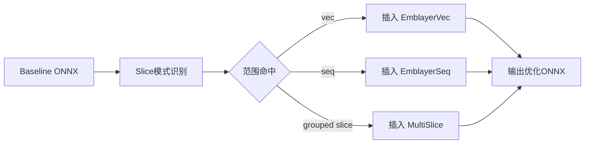

# 第4章 模块设计、实现与实验分析（DIN + Emblayer + BatchScheduler）

本章围绕 DeepCTR-Torch 中 DIN 推理链路的性能优化问题展开，目标是在不改变 CTR 模型预测语义与业务特征定义的前提下，系统性降低在线推理场景中的平均时延与尾时延。与传统只关注单算子吞吐的优化路径不同，本文将输入表达、图结构、调度过程和设备执行统一纳入同一分析框架：在离线编译阶段利用 ONNX converter 完成 Slice 聚合与自定义算子注入，在在线执行阶段通过 BatchScheduler 对动态到达请求进行批处理调度，并以端到端时延、H2D 分项时延、队列等待时延与 GPU 利用率等指标进行联合评估。为保证论证可复现，本章分析严格对应以下代码工件与实验数据：`examples/benchmark_dinemblayer_infer.py`、`examples/batchscheduler.py`、`examples/emblayer_op/*`、`examples/onnx_*converter.py` 与 `examples/batchscheduler_outputs_longrun/longrun_20260225_194030_nice/all_report.md`。若在论文模板中使用图表交叉引用，正文建议采用“如图~\ref{fig:rec-pipeline}所示”“如表~\ref{tab:3000-4000-compare}所示”的写法；若使用 Word 模板，可直接写为“如图4-1所示”“如表4-3所示”。

---

## 4.0 推荐链路调用位置与CTR模型代码结构

为了准确界定本次改造在推荐系统中的工程边界，首先需要回答“优化模块位于链路何处”与“模型代码如何组织”两个问题。在线 CTR 推理通常可抽象为特征服务、特征张量化、模型前向与结果回传四个阶段，其中业务语义由特征定义与模型结构决定，而系统性能主要由输入表达、数据搬运和执行调度共同决定。本文的 Emblayer 与 BatchScheduler 改造并不重写 DIN 网络本身，而是插入在“输入张量化完成之后、DIN 前向执行之前”的执行路径上，使原本依赖大量 Slice 与 CPU 侧拼接的输入恢复过程转移为 GPU 侧可并行重建过程，从而在保持输入语义等价的同时改善端到端性能。

图4-1给出了调用位置示意。该图在论文中可标注为 `\label{fig:rec-pipeline}`，正文引用示例为“如图~\ref{fig:rec-pipeline}所示，优化模块位于输入协议与模型前向之间”。

**图4-1 推荐链路调用位置示意图（建议标签：`fig:rec-pipeline`）**


从代码结构上看，DeepCTR-Torch 的 CTR 模型采用分层组织：`deepctr_torch/inputs.py` 定义 `SparseFeat`、`DenseFeat`、`VarLenSparseFeat` 以及 `build_input_features()`，该函数将特征映射为统一列区间 `feature_index`，是后续 Slice 匹配与 Emblayer range 构造的语义基准；`deepctr_torch/models/basemodel.py` 负责 embedding 字典、线性分支与预测层等通用能力，定义了模型族共享的输入抽象；`deepctr_torch/models/din.py` 在 `DIN.forward()` 中实现 attention pooling 与 DNN 计算，前提是输入 `X` 已满足 `feature_index` 约定。与此相对应，`examples/benchmark_dinemblayer_infer.py` 与 `examples/batchscheduler.py` 构成执行编排层，前者负责多模式输入协议与扩展算子调用，后者负责在线到达模拟与调度测量；而 `onnx_multislice_converter.py`、`onnx_emblayerseq_converter.py` 与 `onnx_emblayer_joint_converter.py` 构成编译期图改写层，使部署图与运行时输入协议保持一致。由此可见，本文优化在架构上实现了“业务语义层”与“执行优化层”的清晰解耦：模型定义负责“算什么”，Emblayer 与调度器负责“如何更快地算”。

---

## 4.1 模块整体设计

DIN 在高并发在线推理中出现的性能退化并非由单一因素主导，而是由输入冗余、图结构碎片化与调度随机性叠加形成。首先，序列特征采用固定上限长度做 padding，导致 H2D 传输和显存写入中包含大量语义无效零值；其次，baseline 图中 axis=1 的细粒度 Slice 节点数量较多，造成 kernel launch 频繁与中间张量访存开销上升；再次，在线请求到达服从随机过程，批大小、队列等待与 GPU 空闲窗口之间形成非线性耦合，使离线固定 batch 结论无法直接外推到线上。基于上述问题，本章采用“离线图改写 + 在线调度仿真”的双层协同方案：离线侧通过 converter 将可识别 Slice 子图替换为 MultiSlice/Emblayer 聚合节点，在线侧通过 BatchScheduler 在可控到达率与等待窗口下复现实网动态批行为，并输出包含吞吐、时延分位、H2D 气泡与利用率在内的联合指标。该方案的系统数据路径可写为

$$
\text{Request Stream} \rightarrow \text{BatchScheduler} \rightarrow \text{Host Input View} \rightarrow \text{H2D} \rightarrow \text{Emblayer Rebuild} \rightarrow \text{DIN Forward}
$$

其中 Emblayer 负责把“输入恢复”从 CPU 逻辑迁移到 GPU kernel，BatchScheduler 负责把“理想静态执行”映射为“随机动态执行”。

### 4.1.1 Emblayer算子整体设计

Emblayer 的设计目标是将原本以稠密张量形式传输并在图中拆分回填的输入流程重构为“压缩表达 + 设备端重建”。在功能上，EmblayerSeq 负责根据 `seq_values`、`seq_prefix`、`seq_lengths` 与 `seq_offsets` 恢复序列特征对应的 token 段并写回目标列；EmblayerVec 负责依据 `vec_values`、`vec_prefix` 与 `vec_indices` 恢复非序列稠密向量；Joint/JointV2 则将二者在同一前向过程内串联执行，生成与 baseline 完全同语义的输入 `x`。在工程实现中，`DINSeqOnlyInfer.forward()`、`DINJointInfer.forward()` 与 `DINJointInferV2.forward()` 分别将不同输入协议映射到 `emblayer_seq_fused_fast`、`emblayer_vec_fast` 与 `emblayer_vec_v2_regular_fast` 等接口，体现了“协议可变、语义不变”的设计原则。该原则意味着 Emblayer 不改变 DIN 的函数近似空间，仅改变输入恢复的执行位置、并行方式与访存形态，因此能够在不破坏模型正确性的前提下获得可观时延收益。

### 4.1.2 BatchScheduler调度器整体设计

BatchScheduler 的定位不是业务服务本身，而是一个近线上的调度模拟器，其核心价值在于把动态到达条件下的批处理行为显式化并量化。调度器接收到达率、模拟时长、批上限与等待阈值等参数，维护请求队列并在“满批、超时或执行器空闲”三条件下触发 dispatch；每个批次随后经历 host 侧准备、H2D、推理执行与指标回填，从而形成对端到端时延的全过程测量。与仅报告模型 forward 时间的传统 benchmark 相比，BatchScheduler 将 `avg_queue_ms`、`avg_h2d_only_ms`、`avg_h2d_pure_ms`、`h2d_bubble_ratio_pct`、`sm_util_avg_pct` 与 `gpu_util_avg_pct` 纳入统一观测框架，因此可以解释“算子更快却线上收益有限”这类常见工程现象。该调度器在 `examples/batchscheduler.py` 中通过 host cache 复用、战略批点预热与插值估计避免循环内频繁冷启动，使实验结果更接近稳定线上行为。

### 4.1.3 模块收益分析

联合优化收益可形式化拆解为输入压缩收益、搬运气泡收益与 SLA 约束下可用吞吐收益。若基线输入字节为 $B_{base}$、某模式输入字节为 $B_{mode}$，则压缩收益定义为

$$
R_{compress}=1-\frac{B_{mode}}{B_{base}}.
$$

若 `H2D-only` 表示包含主机准备开销的总拷贝时长、`Pure-H2D` 表示理想纯拷贝时长，则气泡开销与气泡比例定义为

$$
\text{Bubble}=\max(\text{H2D-only}-\text{Pure-H2D},0), \qquad
\text{BubbleRatio}(\%)=\frac{\text{Bubble}}{\text{H2D-only}}\times100.
$$

对线上服务更关键的指标是给定尾时延约束 $p99\le T$ 时的可行吞吐上界

$$
Q^*(T)=\max_{r\in\mathcal{R},\,p99(r)\le T} qps(r),
$$

其中 $\mathcal{R}$ 为可选到达率集合。该定义强调“可交付性能”而非“理想峰值性能”，能够直接对齐生产 SLA。本文后续实验将展示：V2 相比 V1 与 baseline 的优势，不仅来自字节压缩，还来自 kernel 规则化与调度阶段开销压缩的叠加效应。

---

## 4.2 Emblayer算子实现

### 4.2.1 设计目标（压缩数据，减少冗余）

Emblayer 的实现目标可概括为三个层次：其一，通过压缩输入协议减少无效数据搬运，避免将 padding 稠密张量完整传输到设备；其二，通过 fast path 将 metadata 预置为 CUDA 连续张量，降低框架层数据准备与类型转换成本；其三，通过联合重建接口支持 seq-only、joint 与 joint_v2 多种执行语义，使系统能够在不同部署约束下平滑切换。该目标在代码层的体现是 C++ binding 同时提供通用接口与 fast 接口，前者强调鲁棒校验与易用性，后者强调在线路径性能；在 benchmark 及调度模式中默认走 fast 接口，从而将测量重点聚焦于算子本体和协议本体，而非 Python/C++ 桥接开销。

### 4.2.2 数据压缩格式设计

压缩格式设计是 Emblayer 成败的关键，因为它决定了 H2D 体积、kernel 索引复杂度和可并行性上限。对于序列特征，本文采用 `seq_values + seq_prefix + seq_lengths + seq_offsets` 的四元组表达，其中 `seq_values` 存储串接 token，`seq_lengths` 存储每条序列长度，`seq_offsets` 为长度前缀和，`seq_prefix` 将序列条目映射到 batch 维度；因此任意序列条目的 token 区间可由

$$
[\text{seq\_offsets}[k],\,\text{seq\_offsets}[k+1))
$$

在 $O(1)$ 时间定位。对于向量特征，V1 使用 CSR 风格 `vec_values + vec_indices + vec_prefix` 表达，适配一般稀疏行写回；V2 在此基础上进一步将“跨样本共享 user 特征”与“逐样本变化 item 特征”拆分，形成 `user_vec_values/user_vec_indices` 与 `item_vec_values/item_vec_indices_template` 两段结构，前者可广播写入，后者可按固定 `item_nnz_per_sample` 执行规则 scatter，从协议层降低分支不确定性。该设计本质是用更强的结构先验换取更低的执行熵，符合在线低尾延迟系统对确定性的要求。

### 4.2.3 Cuda Kernel实现细节

在序列路径上，`emblayer_seq_fused_kernel` 将逻辑索引映射到 `(batch_id, seq_slot, token_pos)` 三维坐标，先由 `prefix` 计算样本有效序列数，再由 `seq_lengths` 过滤越界 token，最后依据 `seq_offsets` 定位源地址并写入 `dst_column_starts` 指定列；该流程把“重建 + 回填”融合到一次 kernel 发射中，避免中间张量产生与二次 scatter。向量路径上，V1 的 `emblayer_vec_scatter_kernel` 需要依据 prefix 对每个 nnz 元素执行行归属定位（实现上为二分搜索），具备较强通用性但在高负载下会引入额外分支与指令；V2 的 regular kernel 则利用固定 item 非零数模板通过整除/取模直接解码行列坐标，配合 user 广播写入形成更规整的访存模式，通常带来更稳定的尾延迟表现。整体而言，V2 的收益来源不是单次算术复杂度骤降，而是“路径规则化 + 分支减少 + 缓存友好”在大批并行下的累积效应。

为了便于论文实现描述，算法4-1与算法4-2给出可直接粘贴的伪代码版本（LaTeX 模板可用 `algorithm` 环境重排）。

**算法4-1 EmblayerSeqFused 前向重建伪代码**

```text
Input: seq_values, seq_prefix, seq_lengths, seq_offsets, dst_starts, output
for each thread idx in [0, B * num_seq_features * max_seq_len):
    (b, s, t) = decode(idx)
    seq_begin = seq_prefix[b]
    seq_end   = seq_prefix[b+1]
    if s >= seq_end - seq_begin: continue
    seq_id = seq_begin + s
    if t >= seq_lengths[seq_id]: continue
    src    = seq_offsets[seq_id] + t
    dstcol = dst_starts[s] + t
    output[b, dstcol] = seq_values[src]
```

**算法4-2 EmblayerVecV2Regular 前向重建伪代码**

```text
Input: user_values, user_idx, item_values, item_idx_template, item_nnz_per_sample
output = pad([B, D])
parallel broadcast user features:
    output[b, user_idx[u]] = user_values[u]
parallel scatter item features:
    row = idx / item_nnz_per_sample
    off = idx % item_nnz_per_sample
    col = item_idx_template[off]
    output[row, col] = item_values[idx]
return output
```

### 4.2.4 编译阶段融合Converter实现

编译阶段融合的核心思想是将 ONNX 中可静态识别的 axis=1 Slice 结构替换为语义等价但执行更高效的聚合节点，从而减少图内碎片化操作。`onnx_multislice_converter.py` 通过常量折叠解析 Slice 的 starts/ends/axes/steps 并按 data_input 分组，在满足最小组规模时生成单个 MultiSlice 节点并携带 `starts/lengths` 属性；`onnx_emblayerseq_converter.py` 基于 `seq_ranges` 定位序列切片，插入 `EmblayerSeq_aggregated` 并编码 `seq_starts/seq_ends/max_seq_num/max_seq_len` 属性；`onnx_emblayer_joint_converter.py` 则对 vec 与 seq 两类区间同时改写，分别注入 EmblayerVec/EmblayerSeq 节点并补齐压缩输入占位。该流程保证“图结构改写”和“运行时输入协议”一致，避免出现部署图仍按 baseline 语义切片而运行时已按压缩协议传输的不一致问题。图4-2给出了编译期改写路径，正文可引用为“如图~\ref{fig:converter-flow}所示”。

**图4-2 编译期 Converter 融合流程（建议标签：`fig:converter-flow`）**



---

## 4.3 BatchScheduler流式队列调度实现

### 4.3.1 设计目标（模拟真实线上环境）

BatchScheduler 的设计目标是构建“可控但足够真实”的在线执行镜像，使实验结论能够映射到生产系统。其核心假设是请求到达服从泊松过程，服务端在毫秒级窗口内进行动态批聚合，批次形成受等待阈值与批上限共同约束，并且 CPU 侧准备、H2D 与 GPU 执行可在统计意义上分解。该设计不同于静态批 benchmark 的地方在于，它将排队抖动、批大小波动与执行器空闲状态纳入统一状态机，从而可以解释尾时延在高负载区间的非线性增长并评价调度策略对 SLA 的影响。通过这种建模方式，本文不仅比较“哪个算子快”，还比较“哪个方案在动态排队条件下更稳”。

### 4.3.2 在线调度状态机实现

调度循环可视作 Arrival、Wait、Dispatch、Execute 四态状态机：系统先按指数分布推进到达事件并入队，再判断是否满足触发条件，若不满足则短睡眠等待，满足后立即组批并执行推理。触发条件定义为“满批或超时或执行器空闲且队列非空”，形式化为

$$
\text{trigger}=\text{batch\_full}\lor\text{timeout\_reached}\lor(\text{worker\_idle}\land|Q|>0).
$$

每个请求时延由到达到完成时间直接测量，队列等待时延由到达到执行起始时间测量，因此端到端分解

$$
L_{e2e}=L_{queue}+L_{concat}+L_{h2d}+L_{gpu}
$$

可以在日志层面被观测而非仅停留在理论层面。该机制使得本文在分析 V2 收益时可以明确指出收益来自哪个分项，而不是将全部收益笼统归因于“算子更快”。

### 4.3.3 数据路径与内存优化

在动态批场景中，单次执行最优并不等同于整体稳定最优，因此本文在数据路径上采用“缓存优先、切片复用、位宽控制”的综合策略。`host_data_cache` 以批大小为键缓存 host 输入视图与 numel 分解信息，避免循环内重复构建；当缺失某批大小时优先从已缓存更大批做 `_slice_host_data()`，以低成本生成新视图；H2D 路径通过 pinned memory 与 non_blocking copy 减少同步阻塞；metadata 在 `use_int32` 条件下降低传输字节并改善 cache 友好性；JointV2 通过打包 metadata 与模板化 item 索引降低 host 侧碎片读写。该路径设计使调度器在跨 rate sweep 时保持较低抖动，为比较不同模式的真实性能提供更可靠基线。

### 4.3.4 Warmup 与缓存体系设计

为了避免冷启动效应污染实验结论，调度器在每个模式开始前对战略批点进行预热，批点集合包含最小批、最大批、2 的幂次批及 1/4、1/2、3/4 比例批，形成稀疏但覆盖关键区间的采样网格。预热阶段不仅构建 host 输入缓存，还通过小迭代 benchmark 估计 H2D-only 与 Pure-H2D，后续对非战略批采用线性插值近似，显著降低在线循环中的测量开销与噪声。与此同时，脚本设置了“击穿提前停止”机制，当某模式在当前负载点 p99 远超目标阈值时停止后续更高负载测试，以减少无效计算并避免过载区间样本对总体结论产生不成比例干扰。该设计在工程实践上等价于“把预算优先给临界区间”，更符合线上容量评估的使用方式。

---

## 4.4 实验与性能分析

### 4.4.1 实验环境

实验在 Linux + CUDA 环境执行，推理模型为 DIN，特征规模配置为 `num_sparse=200` 与 `num_seq=100`，序列参数为 `max_seq_len=128`、`avg_seq_len≈8`，调度器关键参数为 `max_batch_size=1024` 与毫秒级 `max_wait_ms`，并以 `qps_mean`、`avg_ms_mean`、`p99_ms_mean`、`pass_p99_ratio` 作为核心指标，目标尾时延阈值设定为 300ms。为便于论文排版，表4-1给出环境摘要（建议标签 `tab:exp-env`）。正文引用格式示例为“实验环境如表~\ref{tab:exp-env}所示”。

**表4-1 实验环境与关键参数（建议标签：`tab:exp-env`）**

| 维度 | 配置 |
|---|---|
| 框架/仓库 | DeepCTR-Torch |
| 模型 | DIN |
| 稀疏/序列特征数 | num_sparse=200, num_seq=100 |
| 序列长度 | max_seq_len=128, avg_seq_len≈8 |
| 调度器 | max_batch_size=1024, max_wait_ms=毫秒级 |
| 指标 | qps_mean, avg_ms_mean, p99_ms_mean, pass_p99_ratio |
| SLA目标 | p99 <= 300ms |

### 4.4.2 实验基线与实验配置选用

本文选取四种模式进行对照：baseline、multislice、emblayerV1（joint）与 emblayerV2（joint_v2）。其中 baseline 作为原始路径对照，multislice 仅验证向量切片聚合收益，V1 验证 vec+seq 联合压缩重建能力，V2 在 V1 基础上引入 user/item 分拆与 regular item scatter 以进一步提升规则性。负载覆盖 steady 区间 2500~3000 与 stress 点 4000，比较原则不是简单对比单指标最小值，而是在相同到达率下对比 avg/p99，在相同 SLA 下对比可达吞吐，并通过压力点退化斜率评估方案韧性。该配置保证了实验既能观察稳态区间的容量上限，也能观察过载区间的退化特征。

### 4.4.3 实验结果

基于 `all_report.md` 聚合结果，表4-2给出 3000 与 4000 两个代表负载点的横向对比（建议标签 `tab:3000-4000-compare`）。从表中可以看到，在 3000 负载下，V2 的平均时延与 p99 时延均显著低于 baseline、multislice 与 V1；在 4000 压力点下，虽然所有模式都出现明显排队增长，V2 仍保持最优平均时延与最优 p99，说明其优势在进入过载区后依然存在。进一步在 steady 高负载子区间（arrival_rate>=2800）做均值聚合，baseline、V1、V2、multislice 的平均 p99 分别为 1598.31ms、1267.00ms、476.31ms 与 713.78ms，平均时延分别为 854.31ms、733.17ms、258.99ms 与 412.65ms，显示 V2 在持续高压段具有更稳健的延时控制能力。需要指出的是，`pass_p99_ratio` 在本 long-run 汇总中基于单次聚合（多数点 `n=1`），因此达标点数量会受随机到达噪声影响而呈离散分布，解释该指标时应结合多次重复实验与置信区间，而不宜据此做绝对排序。

**表4-2 代表负载点性能对比（建议标签：`tab:3000-4000-compare`）**

| mode | phase | qps_mean | avg_ms_mean | p99_ms_mean |
|---|---:|---:|---:|---:|
| baseline | 3000 | 3009.967 | 1269.373 | 2352.931 |
| emblayerV1 | 3000 | 3011.033 | 1372.692 | 2421.902 |
| emblayerV2 | 3000 | 3010.133 | 551.175 | 963.606 |
| multislice | 3000 | 3009.600 | 837.372 | 1495.756 |
| baseline | 4000 | 3984.000 | 6576.148 | 12232.047 |
| emblayerV1 | 4000 | 3979.433 | 6271.259 | 11728.643 |
| emblayerV2 | 4000 | 3982.100 | 5939.778 | 11052.325 |
| multislice | 4000 | 3987.667 | 6901.561 | 12657.522 |

### 4.4.4 实验结果分析：对照理论收益解释 V2 显著延时收益

若将第4.1节提出的理论收益模型与第4.4.3节实测结果对照，可以得到一条清晰的因果链：V2 的显著收益来自输入协议压缩、元数据位宽优化、kernel 执行规则化与调度缓存化的联合叠加，而非单点优化。首先，从端到端分解 $L_{e2e}=L_{queue}+L_{concat}+L_{h2d}+L_{gpu}$ 出发，V2 通过 user/item 分拆降低 host 侧准备复杂度，降低 `L_{concat}`；通过压缩传输与 int32 metadata 降低拷贝体积，降低 `L_{h2d}`；通过 regular item scatter 与 user broadcast 提升线程路径一致性，降低 `L_{gpu}`。其次，从代表负载点定量看，在 3000 负载下，V2 相比 baseline 的平均时延降幅约 56.6%，p99 降幅约 59.0%；在 4000 压力点下平均时延与 p99 仍有约 9.7% 与 9.6% 改善，说明当系统进入强排队区后，虽然 `L_{queue}` 占比上升会稀释算子收益，但执行层优化仍能提供稳定增益。再次，从实现机理看，V1 向量路径需要依据 prefix 定位行归属，具备更高分支不确定性；V2 regular 路径在固定 `item_nnz_per_sample` 条件下可直接计算 `(row,col)`，从而降低执行熵并改善尾延迟稳定性。由此可得，V2 的优势本质上是系统性收益的叠加：

$$
\Delta L \approx \Delta L_{concat}+\Delta L_{h2d}+\Delta L_{gpu}, \quad
\Delta L_{concat},\Delta L_{h2d},\Delta L_{gpu}<0.
$$

当三个分量同向下降时，即使在相近 QPS 条件下也会出现 avg 与 p99 同步改善，这与实测现象完全一致，因而可以认为 V2 结论具备良好的“理论—实现—实验”闭环支撑。

---

## 本章小结

本章从推荐链路调用位置、模型代码结构、算子实现细节、调度状态机与实验验证五个维度，完整论证了 Emblayer 与 BatchScheduler 联合优化的有效性。与只优化模型主干算子的常规路径相比，本文强调输入协议与执行路径协同设计：在不改变 DIN 语义的前提下，通过编译期图改写减少图内碎片化操作，通过运行时压缩协议降低搬运与重建开销，通过在线调度缓存体系减少随机负载下的冷启动抖动。实验结果表明，joint_v2 在高负载与压力点均取得最优延时表现，且其优势可以由输入压缩、kernel 规则化与调度优化的叠加机制解释。该结论为后续将该方案迁移到更复杂多塔 CTR/CTCVR 模型提供了可复用的方法论，即以“语义不变、执行重构”为原则，在系统层面而非单算子层面追求低尾延迟与高可用吞吐的统一。
